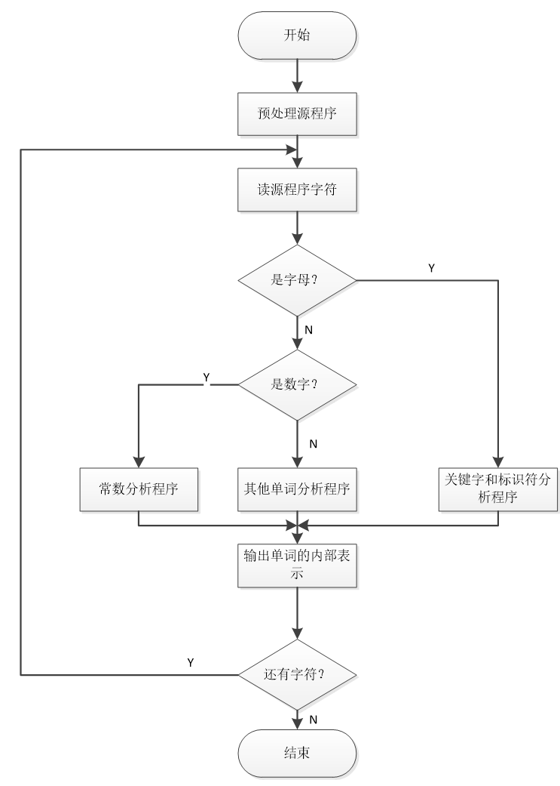
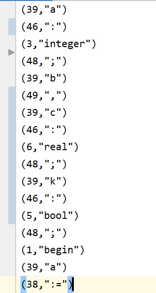
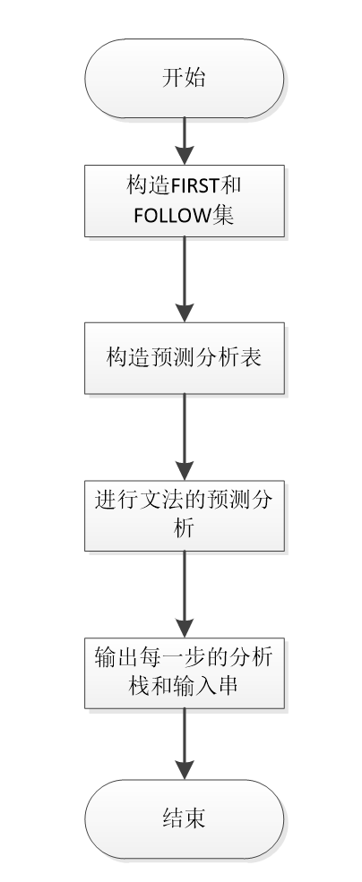
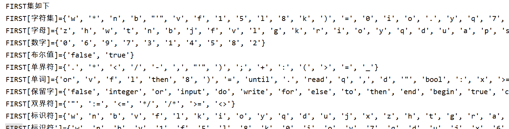
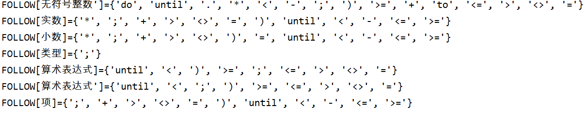
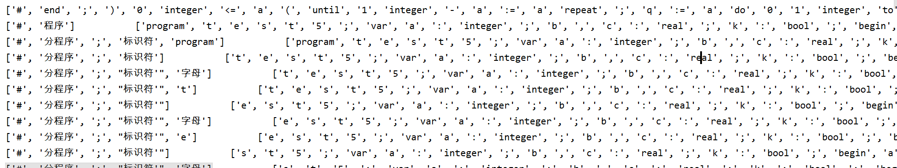
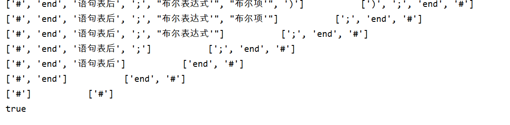
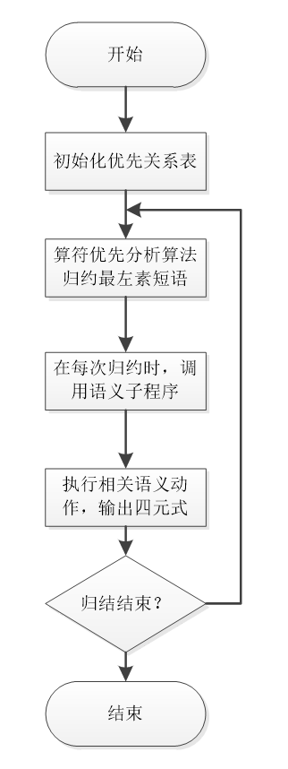
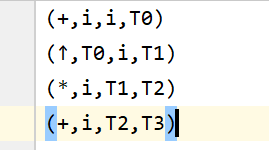

## **1 实验目标**

- [x] 设计、编写词法分析程序。

- [x] 设计、编写语法分析程序。

- [x] 设计、编写语法制导翻译程序，

## **2 实验内容**

### 2.1 词法分析器

##### 需求

设计一个简单的词法扫描器。其输入是源程序字符串，输出是二元式（种别编码，单词的属性值），例如“＝”符号的输出形式为（8，－），其中种别编码可参照书中P30表3-1自拟某程序设计语言的单词表及其种别编码。实现方法参考书中P34－P36函数和程序框架。

##### 程序流程图



##### 处理步骤

1. 输入和预处理：程序源代码被存储在TXT文件中，输入到程序中对源代码进行预处理。删除掉多余的空白符，回车符，换行符以及注释等对执行源程序无用的信息，在处理过程中，遇到这一系列符号均用一个空格表示。
2. 单词符号的识别
3. 标识符和关键词的识别：以字母开头的“字母/数字”串。
4. 数值型常数的识别：以数字开头的数字串
5. 算符和界符的识别：当首字符既不是字母也不是数字时，考虑这种情况。并且如果两种算符或界符的首府相同时候，需要使用超前搜索，并采取最长匹配原则。例如：当读到首字符为’/’是有可能是’/’除号，也可能是’/\*’注释符。这是每当读到首符号为’/’时，指针要多向前搜索一个字符，如果是’\*’那说明匹配到’/\*’,如果是其他字符，说明匹配的是’/’，此时指针回退一个。
6. 输出符号表

7. 识别标识符和常数后，保存二元式。

##### 输出二元式



### 2.2 语法分析器

##### 要求

自上而下的语法分析方法：构造所用文法的预测分析表，实现方法参考书中算法描述。利用所得预测分析表采用自上而下的语法分析方法对输入串进行分析。例如，若根据书中算术表达式文法构造的预测分析表，那么对输入表达式i+i＃进行语法分析，输出为分析过程

##### 程序流程图



##### 步骤：

1. 设计文法:我采用的是书中L语言文法，消除左递归和回溯、提左公因子后，还进行了一定程度的改造，成为LL(1)文法。详见附录。
2. 构造FIRST集:采用书算法4.3构造FIRST集
3. 构造FOLLOW 集：采用书算法4.4构造FOLLOW集
4. 构造预测分析表：根据构造的FIRST和FOLLOW集，根据书算法4.5构造预测分析表
5. 进行预测分析：依据算法4.2。对于分析栈，开始时，将“\#”压入栈底，然后压入文法的开始符号，每当栈顶是非终结符是，将其弹出栈，然后逆序压入该非终结符右部的各个符号。对于存放输入串的栈，先压入“\#”，在从做向右逆序压入栈.任何时候，栈顶符号和当前的输入符号决定了预测分析程序所应执行的分析动作。

##### 输出结果（First&Follow&预测分析表）

1.构造FIRST集



2.构造FOLLOW集



3.预测分析表

{'字符集': {'z': ['字母'], 'v': ['字母'], 'x': ['字母'], 'p': ['字母'], 'g': ['字母'], 'u': ['字母'], 'j': ['字母'], 'f': ['字母'], 'k': ['字母'], 'e': ['字母'], 'n': ['字母'], 'b': ['字母'], 'y': ['字母'], 'a': ['字母'], 't': ['字母'], 'w': ['字母'], 'm': ['字母'],…}

4.预测分析过程





### 3.1 基于算符优先分析方法的语法制导翻译

##### 要求

采用书中P72表5-1所示的算符优先表（直接使用表5-1所示的优先关系，无需程序实现），对输入表达式进行语法分析的基础上，进行语义翻译工作。每当归约最左素短语时，就调用对应产生式的语义子程序，完成相应的翻译工作

##### 原理

程序流程图：



- 素短语：至少包含一个终结符的短语，并且除其自身外不再包含任何更小的素短语。最左素短语时指处于句型最左边的那个素短语。

- 算符优先分析算法

  > 算符优先文法的句型可以写为：
  >
  > `\# N1a1N2a2 N3a3…Nnan Nn+1\#`
  >
  > 每个a都是终结符，每个N是可有可无的非终结符。一个算符优先文法的任何句型的最左素短语Njaj…Niai Ni+1是满足如下条件的最左字串:
  >
  > ```
  > aj-1\< aj
  > 
  > aj= aj+1,…,ai-1=ai
  > 
  > ai\>ai+1
  > ```
  >
  > 算符优先分析算法就是基于该定理，对当前句型不断寻找最左素短语进行归约的过程。寻找到最左素短语是，先找到其末尾的终结符，然后再向前搜索其首终结符。

- 语法制导翻译

  > 在语法分析过程中，构建语法分析树。由于python设计语言的显示，在实际设计过程中，我采用的是类树的结构，用字典中的键保存树名，其值是树结点类的实例。也就是说，在进行语法分析的同时完成了翻译工作。每当归约最左素短语的时候就调用对应产生式的语义子程序。完成翻译工作。newtemp函数用于生成一个新的临时变量。gen函数用于将一个新的四元式加入到四元式表的末尾。


##### 结果

输入串为：`i+i\* (i+i)↑i`

算符优先分析过程：

```
['\#'] ['i', '+', 'i', '\*', '(', 'i', '+', 'i', ')', '↑', 'i', '\#']

['\#', 'i'] ['+', 'i', '\*', '(', 'i', '+', 'i', ')', '↑', 'i', '\#']

['\#', 'N0'] ['+', 'i', '\*', '(', 'i', '+', 'i', ')', '↑', 'i', '\#']

['\#', 'N0', '+'] ['i', '\*', '(', 'i', '+', 'i', ')', '↑', 'i', '\#']

['\#', 'N0', '+', 'i'] ['\*', '(', 'i', '+', 'i', ')', '↑', 'i', '\#']

['\#', 'N0', '+', 'N1'] ['\*', '(', 'i', '+', 'i', ')', '↑', 'i', '\#']

['\#', 'N0', '+', 'N1', '\*'] ['(', 'i', '+', 'i', ')', '↑', 'i', '\#']

['\#', 'N0', '+', 'N1', '\*', '('] ['i', '+', 'i', ')', '↑', 'i', '\#']

['\#', 'N0', '+', 'N1', '\*', '(', 'i'] ['+', 'i', ')', '↑', 'i', '\#']

['\#', 'N0', '+', 'N1', '\*', '(', 'N2'] ['+', 'i', ')', '↑', 'i', '\#']

['\#', 'N0', '+', 'N1', '\*', '(', 'N2', '+'] ['i', ')', '↑', 'i', '\#']

['\#', 'N0', '+', 'N1', '\*', '(', 'N2', '+', 'i'] [')', '↑', 'i', '\#']

['\#', 'N0', '+', 'N1', '\*', '(', 'N2', '+', 'N3'] [')', '↑', 'i', '\#']

['\#', 'N0', '+', 'N1', '\*', '(', 'N4'] [')', '↑', 'i', '\#']

['\#', 'N0', '+', 'N1', '\*', '(', 'N4', ')'] ['↑', 'i', '\#']

['\#', 'N0', '+', 'N1', '\*', 'N5'] ['↑', 'i', '\#']

['\#', 'N0', '+', 'N1', '\*', 'N5', '↑'] ['i', '\#']

['\#', 'N0', '+', 'N1', '\*', 'N5', '↑', 'i'] ['\#']

['\#', 'N0', '+', 'N1', '\*', 'N5', '↑', 'N6'] ['\#']

['\#', 'N0', '+', 'N1', '\*', 'N7'] ['\#']

['\#', 'N0', '+', 'N8'] ['\#']

['\#', 'N9'] ['\#']
```

输出的四元式：




**四、参考文献**

[1] 鲁斌,李继荣，黄建才 编译技术基础教程. 清华大学出版社, 第一版. 2011年10月